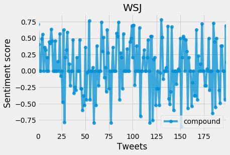
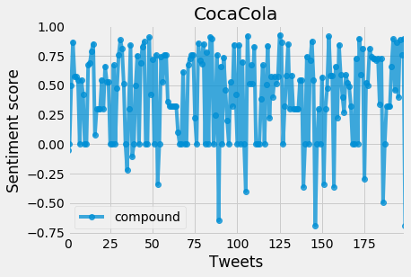

#   Twitter Bot - Sentiment Analysis

Social Media Analysis Project. Sentiment Analysis of tweets on Twitter pages. Twitter Bot listens for requests on sentiment analysis and posts back an image of the analysis to the tweeter. @PySentimentBot https://twitter.com/PySentimentBot


```python
# Dependencies
import tweepy
import json
import pandas as pd
import numpy as np
import matplotlib.pyplot as plt
from datetime import datetime

import os

import time

plt.style.use('fivethirtyeight')

# Import and Initialize Sentiment Analyzer
from vaderSentiment.vaderSentiment import SentimentIntensityAnalyzer
analyzer = SentimentIntensityAnalyzer()


consumer_key = os.getenv("bot_consumer_key")
consumer_secret = os.getenv("bot_consumer_secret")
access_token = os.getenv("bot_access_token")
access_token_secret = os.getenv("bot_access_token_secret")


# Setup Tweepy API Authentication
auth = tweepy.OAuthHandler(consumer_key, consumer_secret)
auth.set_access_token(access_token, access_token_secret)
api = tweepy.API(auth, parser=tweepy.parsers.JSONParser())
```


```python
def parse_requests(tweet, tweet_dict=dict()):
    tweet_data = []
    tweet_id = tweet["id"]
    tweet_user = tweet["user"]["screen_name"]
    tweet_requests = []
    for mentions in tweet["entities"]["user_mentions"]:
        if (mentions["screen_name"] != "PySentimentBot"):
            tweet_requests.append(mentions["screen_name"])
    
    tweet_dict = {"id":tweet_id,"user":tweet_user,"analysis_requests":tweet_requests}
    return tweet_dict
```


```python
def analyze_sentiments(recent_tweets, sentiment_results=list()):
    sentiment_results = []
    for tweet in recent_tweets:
        new_tweet = cleanse_tweet(tweet)
        sentiment_result = analyzer.polarity_scores(new_tweet["text"])
        sentiment_result.update({"tweet_id":new_tweet["id"]})
        sentiment_results.append(sentiment_result)    
    return sentiment_results
```


```python
def remove_noise(tweet, category, key, result_tweet=dict()):
    try:
        result_tweet = tweet
        tweet_text = tweet.get("text")
        tweet_items = tweet.get("entities").get(category)
        for item in tweet_items:
            replace_str = item[key]
            tweet_text = tweet_text.replace(replace_str," ")
        result_tweet["text"] = tweet_text
    except TypeError:
        pass
    return result_tweet

def cleanse_tweet(tweet,result_tweet=dict()):
    result_tweet = tweet
    result_tweet = remove_noise(result_tweet,"user_mentions","screen_name")
    result_tweet = remove_noise(result_tweet,"urls","url")
    result_tweet = remove_noise(result_tweet,"media","url")
    result_tweet["text"] = result_tweet["text"].replace("@","")
    return result_tweet
```


```python
def color_map(value):
    if(value >= 0): 
        return 'g'
    else:
        return 'r'

def plot_sentiments(title,sentiments):
    df = pd.DataFrame(sentiments)
    df = df.reset_index()
    df.plot( 'index', 'compound', linestyle='-', marker='o',alpha=0.75)
    plt.ylabel("Sentiment score")
    plt.xlabel("Tweets")
    plt.title(title)
    
    filename = "SentimentAnalysis_of_"+title+".png"
    plt.savefig(filename)
    plt.show()
    
    return filename  
```


```python
def scan_for_requests(since_tweet_id):
    
    total_tweets_so_far = 0
    
    last_tweet_id = since_tweet_id
    
    search_handle = "@PySentimentBot"

    results = api.mentions_timeline(since_tweet_id)
    
#     print(f"Total results retrieved - {len(results)}")

    if(len(results) > 0):
        
        tweet_data = []
#         print(results)

        for tweet in results:
            parsed_tweet = parse_requests(tweet)
            last_tweet_id = tweet['id']
#             print(f"Parsed tweet - {tweet}")
            tweet_data.append(parsed_tweet)
#         print(f"tweet data - {tweet_data}")
        
        for item in tweet_data:
            
            

            recent_tweets = []

            for analyze_request in item["analysis_requests"]:

                recent_tweets = api.user_timeline(analyze_request,count=200)
                
                print(f"{analyze_request} - {len(recent_tweets)}")
                
                if(len(recent_tweets) > 0):
                    sentiments = analyze_sentiments(recent_tweets)
#                     print(sentiments)
                    sentiment_fig = plot_sentiments(analyze_request,sentiments)
                    text_status = f"{datetime.now()} - Thank you for your tweet @{item['user']}! Here is the sentiment analysis of {analyze_request}!"
                    api.update_with_media(filename=sentiment_fig,status=text_status,in_reply_to_status_id=item["id"])
                else:
                    text_status = f"{datetime.now()} - Thank you for your tweet @{item['user']}! Sorry, {analyze_request} has no tweets!" 
                    api.update_status(text_status)
                        
                    total_tweets_so_far = total_tweets_so_far + 1
                plt.show()
        return last_tweet_id
    else:
        return last_tweet_id
```


```python
since_tweet_id = 972689847545749504

while True:
    time.sleep(30)
    since_tweet_id = scan_for_requests(since_tweet_id)    

```

    WSJ - 200
    





    CocaCola - 200
    




